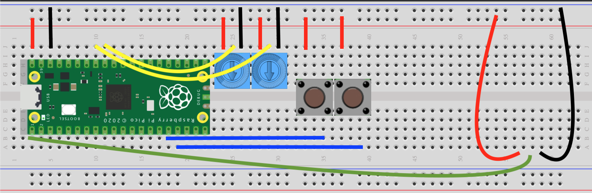

# neopixel-pico

This is a port of another project that runs on a python webserver with a simple webapp to control.

The microcontroller has 4 inputs:
* potentiometer (ADC): Controls the brightness of the LED strip
* potentiometer (ADC): Controls the stepsize (1-128) on a walk between two colors
* button: Cycles through each algorithm in the array, when index == length the LEDs turn off.
* button: unused.
